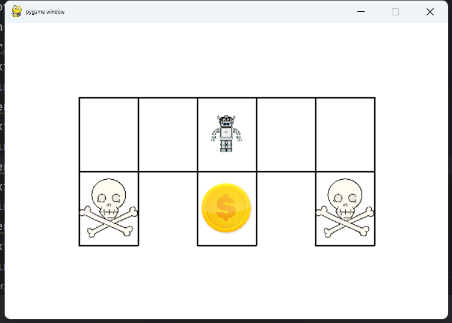

# Grid Environment for Reinforcement Learning



This Python script defines a Grid Environment suitable for Reinforcement Learning tasks. The environment is designed based on the [OpenAI Gym](https://gym.openai.com/) framework, making it compatible with a variety of existing reinforcement learning algorithms.

```python
import random
import sys
from typing import Optional

import pygame
import  gym

class GridEnv(gym.Env):
    ...
```

## Key Features

- **State Space**: The environment includes 8 possible states.
- **Actions**: The agent can perform 4 different actions - 'n', 'e', 's', 'w'.
- **Reward Mechanism**: Reward values are assigned to specific state-action pairs.
- **State Transition**: The transition function is defined in terms of state-action pairs, determining the next state after a given action is performed in a specific state.
- **Terminal States**: Three terminal states are defined. Once these states are reached, the episode ends.
- **Visualisation**: The environment can be rendered for visual inspection, using the Pygame library. It includes depictions of the agent, traps, and a goal state.

## How to use

1. Instantiate the environment.

```python
env = GridEnv(render_mode='human')
```

1. Reset the environment before the start of each episode.

```python
start = env.reset()
```

1. At each step of the episode, take an action. This will return the new state, reward, and a flag indicating if the episode has ended.

```python
action = 'n'  # or 'e', 's', 'w'
next_state, r, over,*_ =env.step(action)
```

1. Render the environment to visualize the state of the agent in the grid.

```python
env.render()
```

Please note that the provided code assumes certain image files (`robot.png`, `trap.png`, `gold.png`) are available in the working directory for rendering purposes.

For a complete understanding of the code, it is recommended to have familiarity with the gym environment interface and Python's dictionary data type for encoding reward and state transition mechanisms.
